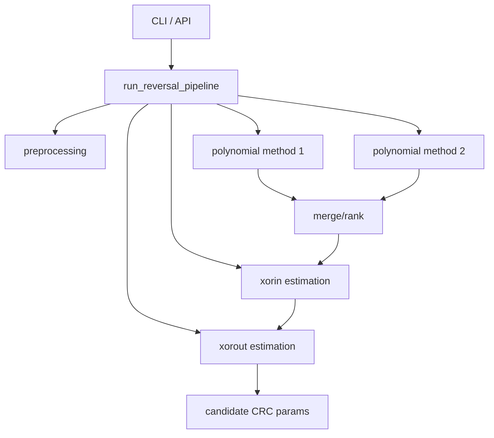

# Architecture

## Overview

The project has three layers:

1. Interface layer:
- `crc_reverse.cli` for command-line workflows.
- `crc_reverse.api` for programmatic use.
- legacy interactive flow in `crc_reverse.ui_functions`.

2. Orchestration layer:
- `crc_reverse.crc_reversing` coordinates multi-step reversal.

3. Algorithm layer:
- polynomial estimation: methods 1 and 2.
- seed/xor estimation: `xorin_reversing`, `xorout_reversing`.
- utility and preprocessing modules.



## Data model

- Input packet format: `data || crc` (concatenated bytes).
- Core result format: `(poly, width, seed, ref_in, ref_out, xor_out)`.
- Public API result model: `CrcReverseResult`.

## Performance

- Default path is pure Python + NumPy.
- Optional accelerated GF(2) arithmetic exists in `crc_reverse.performance`.
- Enable with:

```bash
CRC_REVERSE_USE_NUMBA=1
```

and install:

```bash
pip install -e ".[perf]"
```
